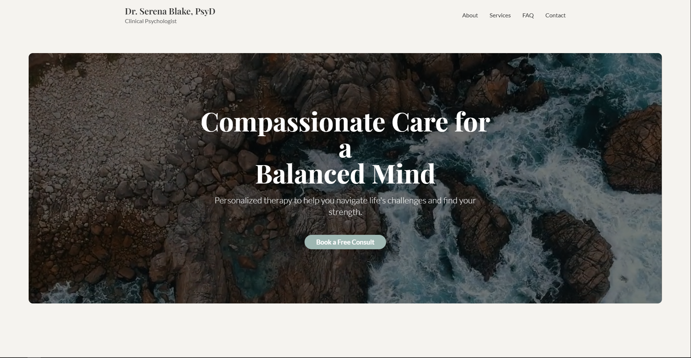

# Therapist Website Build

This project is a single-page website built for an imaginary therapist, Dr. Serena Blake.

The primary goal was to closely replicate a provided reference design, focusing on attention to detail, responsiveness, and a polished user experience.

### ✨ **[Live Demo on Vercel](https://faded-blake-site.vercel.app/)** ✨

---


---

## 🚀 About The Project

This is a fully responsive, single-page website designed to be a modern and calming online presence for a mental health professional. The development process leveraged AI tools for initial scaffolding, followed by manual code refinement to achieve a pixel-perfect match with the design specifications and to implement custom interactive features.

### Key Features

*   **Responsive Design:** A mobile-first approach ensures a seamless experience on all devices, from phones to desktops.
*   **Dynamic Navbar:** The navigation bar intelligently hides on scroll-down and reappears on scroll-up for an unobtrusive browsing experience.
*   **Engaging Hero Section:** Features an autoplaying, looping background video to immediately capture user attention.
*   **Smooth Animations:** Subtle fade-in-on-scroll animations are used throughout the site to elegantly reveal content.
*   **Interactive Components:** Includes an accordion for the FAQ section and a contact form with a client-side animated success state upon submission.

---

## 🛠️ Tech Stack

This project was built using a modern frontend stack:

*   **Framework:** [React](https://reactjs.org/) (via [Vite](https://vitejs.dev/))
*   **Styling:** [Tailwind CSS](https://tailwindcss.com/)
*   **UI Components:** [Shadcn/UI](https://ui.shadcn.com/)
*   **Animation:** [Framer Motion](https://www.framer.com/motion/)
*   **Deployment:** [Vercel](https://vercel.com/)

---

## ⚙️ Running Locally

To get a local copy up and running, follow these simple steps.

1.  **Clone the repository**
    ```sh
    git clone https://github.com/your-username/your-repo-name.git
    ```
2.  **Navigate to the project directory**
    ```sh
    cd your-repo-name
    ```
3.  **Install NPM packages**
    ```sh
    npm install
    ```
4.  **Run the development server**
    ```sh
    npm run dev
    ```
    The application will be available at `http://localhost:5173`.

---

## Acknowledgment

*   This project was completed as an assignment for the **Grow My Therapy** internship program.
*   Design inspiration was drawn from [drjenniferhahm.com](https://www.drjenniferhahm.com/).